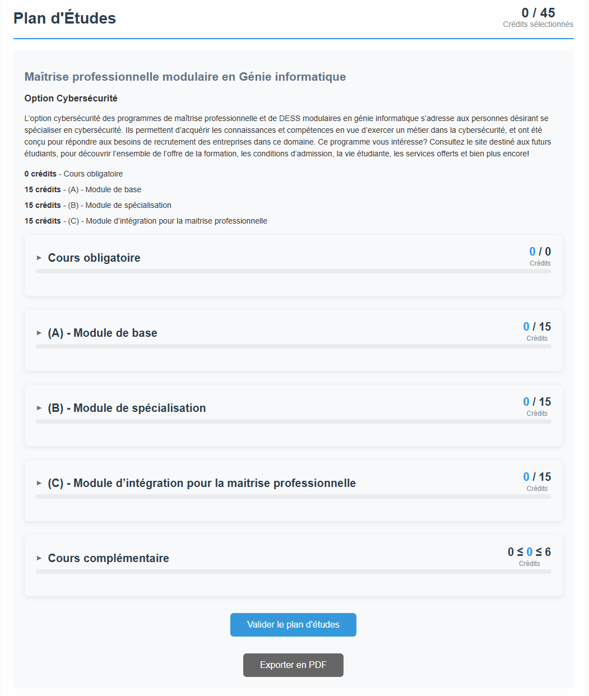
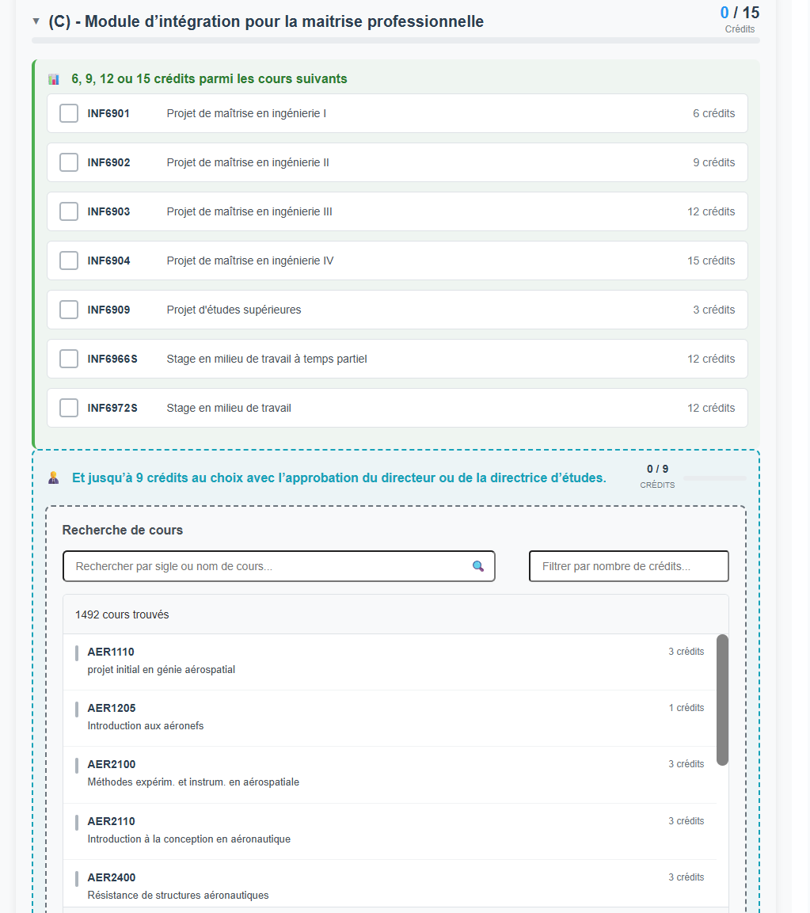
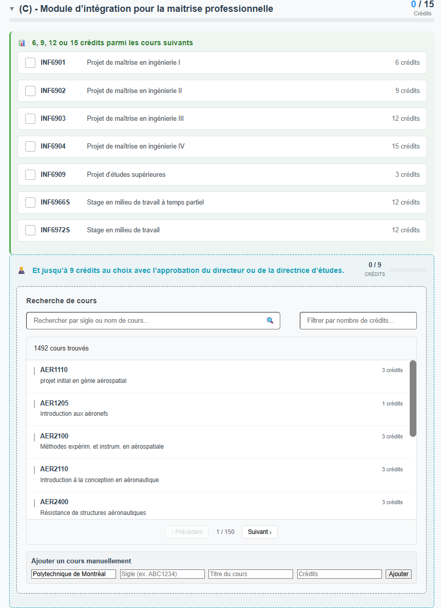
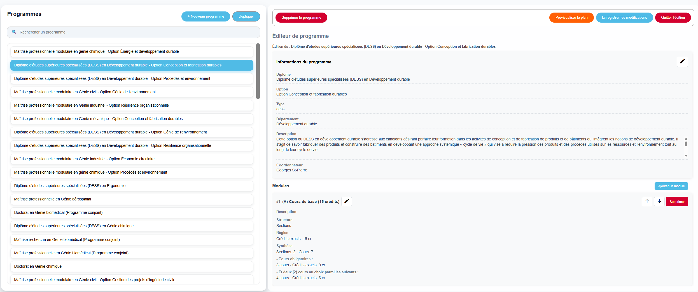
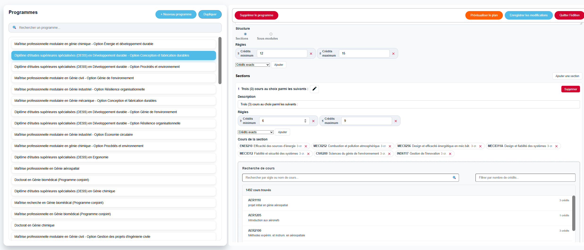

# PlaniSup

A full-stack graduate study plan management platform built for Polytechnique Montréal. Students submit study plans that go through a structured multi-role approval workflow, with real-time validation at every step.

The platform was adopted by Polytechnique Montréal, who hired two team members to continue development post-graduation.

## Features

- Real-time validation engine that checks credit totals, module distribution, mandatory courses, and prerequisite conflicts against configurable institutional rules
- Multi-role sequential approval workflow: student → director → coordinator → admin agent → registrar
- Per-step chat and feedback system between student and each approver
- CAS (Central Authentication Service) integration with Polytechnique's SSO
- Web scraper that extracts, normalizes, and loads Polytechnique's full graduate course catalog into MongoDB

## Previews

### Student Workspace

#### Study Plan Dashboard
Shows the real-time validation progress of a student's study plan across all program modules (mandatory, basic, specialization, integration, and complementary courses).


#### Course Selection & Integration
Allows students to search the normalized course catalog and select courses under specific modules based on requirements.


#### Manual Course Addition
Provides an interface for students to manually add external courses with custom codes, titles, and credit values.


### Administrator Dashboard

#### Program Editor
Enables coordinators and admins to manage all available degrees/specializations and modify their high-level metadata and modular structures.


#### Validation Rules Configurator
Enables deep customization of credit ranges, custom course lists, and validation rules for each module in a degree program.


## Tech Stack

| Layer | Technology |
|---|---|
| Frontend | Angular, TypeScript, SCSS |
| Backend | Node.js, Express.js |
| Database | MongoDB |
| Auth | Polytechnique CAS (SSO) |
| Deployment | Polytechnique Montréal servers |

## Project Structure

```
├── frontend/          # Angular client
├── backend-express/   # Node.js REST API server
└── common/            # Shared types and interfaces
```


## Team

Built by a team of 5 as a capstone project in the Software Engineering program at Polytechnique Montréal.
